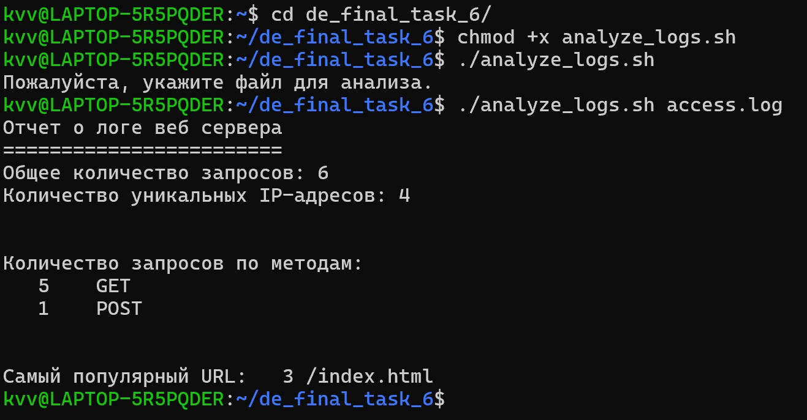

# Bash скрипт для анализа файла access.log

Подсчитывает общее количество запросов, количество уникальных IP-адресов, количество запросов по методам (GET, POST и т.д.), находит самый популярный URL и создает отчет в виде текстового файла - report.txt.

## Предустановка

Наличие linux-подобной операционной системы.

## Установка

Клонировать репозиторий командой:
```sh
git clone https://github.com/delphython/django-orm-watching-storage.git
```

## Использование

1. Скопировать файл access.log в директорию проекта;
2. Сделать скрипт исполняемым:
```sh
chmod +x analyze_logs.sh
```
3. Запустить скрипт:
```sh
./analyze_logs.sh access.log
```

## Результат
В результате выполнения всех шагов в разделе *Использование* на экран выведется следующее:


## Meta

Vitaly Klyukin — [@delphython](https://t.me/delphython) — [delphython@gmail.com](mailto:delphython@gmail.com)

[https://github.com/delphython](https://github.com/delphython/)
